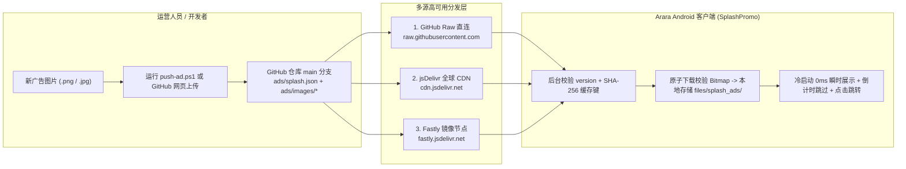

# Arara 开屏广告图片远程推送方案 (GitHub Splash Ad Push Guide)

本方案实现了**零服务器成本、免发版动态更换开屏广告图片与跳转链接**的完整闭环。App 直接从 GitHub 仓库 [`https://github.com/TestersNightmare/arara.git`](https://github.com/TestersNightmare/arara.git) 的 `ads/` 目录提取配置与广告素材。

---

## 一、 整体架构与拉取链路



### 核心设计亮点
1. **多源自动容灾 (Multi-CDN Failover)**：
   - 客户端按优先级依次尝试：
     1. `https://raw.githubusercontent.com/TestersNightmare/arara/main/ads/splash.json`（秒级生效）
     2. `https://cdn.jsdelivr.net/gh/TestersNightmare/arara@main/ads/splash.json`（全球边缘加速，巴西与中国访问稳定）
     3. `https://fastly.jsdelivr.net/gh/TestersNightmare/arara@main/ads/splash.json`（备用骨干网镜像）
   - 无论用户在巴西本地网络还是跨国网络，均可稳定拉取广告。
2. **双模启动展示策略（首启即时拉取 + 次启 0ms 秒开）**：
   - **首次安装启动**：展示 Arara 品牌启动屏，同时开启最高 `2.5 秒` 的快速拉取通道；若网络正常将在首启当次直接展示远程广告，若超时或离线则平滑降级到内置默认海报（`assets/splash_default.png`），绝不卡白屏。
   - **日常冷启动**：**0 毫秒延迟**直接读取本地已缓存的高清海报展示，同时在后台异步同步 `ads/splash.json`，发现新 `version` 或新图片路径时静默下载并清理旧缓存。
3. **原子级文件替换与校验**：
   - 下载图片先写入 `.tmp` 临时文件，经 `BitmapFactory.decodeFile` 校验确认为完整合法图片后才原子重命名为正式缓存文件，杜绝断网导致的残损图片或黑屏。
4. **四语言原生适配 (`pt-BR` / `es` / `en` / `zh`)**：
   - 支持针对不同语言配置专属广告图 (`images`)、专属落地页 (`links`) 和专属行动按钮文案 (`cta_texts`)，倒计时跳过按钮（`Pular 4s` / `Saltar 4s` / `Skip 4s` / `跳过 4s`）及广告角标随系统或应用内语言自动切换。

---

## 二、 配置文件规范 (`ads/splash.json`)

仓库中的 [`ads/splash.json`](../ads/splash.json) 同时支持 **极简模式（单条广告）** 与 **多活动排期轮播模式（Campaigns）**。

### 2.1 极简模式（只需 5 个字段即可推送）

如果只需要快速推送一张全语种通用的广告图，将 `ads/splash.json` 写为：

```json
{
  "enabled": true,
  "version": "2026.10.08.1",
  "duration_seconds": 4,
  "image": "ads/images/my_banner.jpg",
  "link": "/collections/all"
}
```

### 2.2 完整多活动/多语言/定时排期模式

```json
{
  "enabled": true,
  "version": "2026.10.07.1",
  "duration_seconds": 4,
  "show_interval_minutes": 0,
  "strategy": "priority",
  "image": "ads/images/splash_default.png",
  "link": "/",
  "campaigns": [
    {
      "id": "brazil_black_friday",
      "enabled": true,
      "priority": 100,
      "weight": 10,
      "version": "2026.10.07.1",
      "duration_seconds": 5,
      "image": "ads/images/splash_default.png",
      "images": {
        "pt-BR": "ads/images/splash_default.png",
        "es": "ads/images/splash_default.png",
        "en": "ads/images/splash_default.png",
        "zh": "ads/images/splash_default.png"
      },
      "link": "/",
      "links": {
        "pt-BR": "https://ararabr.com/",
        "es": "https://ararabr.com/",
        "en": "https://ararabr.com/en",
        "zh": "https://ararabr.com/"
      },
      "cta_texts": {
        "pt-BR": "Ver Coleção Nova →",
        "es": "Ver Nueva Colección →",
        "en": "Shop New Collection →",
        "zh": "查看最新系列 →"
      },
      "open_external": false,
      "start_time": "2026-01-01T00:00:00Z",
      "end_time": "2030-12-31T23:59:59Z"
    }
  ]
}
```

### 2.3 字段说明表

| 字段名 | 类型 | 必填 | 说明 |
| :--- | :--- | :---: | :--- |
| `enabled` | `Boolean` | 是 | 全局总开关。设为 `false` 可一键紧急下线所有开屏广告 |
| `version` | `String` | 是 | 版本标识（如 `"2026.10.07.2"`）。即使图片文件名不变，只要修改 `version` 也会强制客户端重新下载图片 |
| `duration_seconds` | `Int` | 否 | 倒计时秒数（范围 `2` ~ `15`，默认 `4` 秒） |
| `show_interval_minutes` | `Int` | 否 | 频控间隔（分钟）。`0` 表示每次冷启动都展示；设为 `60` 表示同一用户 1 小时内最多展示 1 次 |
| `strategy` | `String` | 否 | 多广告选择策略：`"priority"`（按优先级最高）、`"random"`（按 `weight` 权重随机）、`"round_robin"`（顺序轮播） |
| `image` | `String` | 是 | 广告图路径。支持**仓库相对路径**（如 `"ads/images/promo.jpg"`）或**外部完整 URL**（`https://...`） |
| `images` | `Object` | 否 | 按语言（`pt-BR`, `es`, `en`, `zh`）指定不同语言的专属广告海报图 |
| `link` | `String` | 否 | 点击跳转目标。支持 `ararabr.com` 站内相对路径（如 `"/collections/all"`）或完整 `https://` 链接 |
| `cta_texts` | `Object` | 否 | 底部行动按钮的四语言文案（如 `"Ver Oferta →"`） |
| `open_external` | `Boolean` | 否 | `false`（默认）在 App 内置 WebView 打开；`true` 唤起系统外部浏览器打开 |
| `start_time` / `end_time` | `String` | 否 | 活动生效/失效时间（ISO-8601 UTC 格式，如 `"2026-11-25T00:00:00Z"`），支持提前配置大促排期 |

---

## 三、 广告图片推送操作指南（3 种方式）

### 方式一：使用一键推送脚本 `push-ad.ps1`（最推荐，10 秒完成）

项目根目录已内置 [`push-ad.ps1`](../push-ad.ps1) 脚本，只需在 PowerShell 中执行：

```powershell
# 1. 推送新广告图片并设置跳转链接与展示时长（自动生成带时间戳的文件名与 version 并 git push）
.\push-ad.ps1 -ImagePath "C:\path\to\new_banner.jpg" -Link "/collections/all" -Duration 5

# 2. 自定义底部按钮文案推送
.\push-ad.ps1 -ImagePath ".\banner_sale.png" -Link "/products/noma" -Duration 4 `
    -CtaPt "Comprar Agora →" -CtaEs "Comprar Ahora →" -CtaEn "Buy Now →" -CtaZh "立即抢购 →"

# 3. 一键紧急关闭开屏广告
.\push-ad.ps1 -Disable
```

### 方式二：直接在 GitHub 网页端（或手机端 GitHub App）可视化操作

无需电脑开发环境，随时随地通过浏览器更换广告：
1. 打开仓库 [`https://github.com/TestersNightmare/arara`](https://github.com/TestersNightmare/arara)，进入 `ads/images/` 目录。
2. 点击右上角 **Add file → Upload files**，上传新的广告图片（推荐竖版 `1080×1920` JPG/PNG，大小控制在 `500KB` 以内以获得最佳加载速度），例如命名为 `promo_oct.jpg`，点击 **Commit changes**。
3. 打开 [`ads/splash.json`](../ads/splash.json)，点击右上角铅笔图标（Edit）：
   - 将 `"version"` 改为新的日期序号（如 `"2026.10.08.1"`）
   - 将 `"image"`（及 `campaigns[0].image` / `images`）改为 `"ads/images/promo_oct.jpg"`
   - 修改 `"link"` 为目标商品或活动集合页地址
4. 点击 **Commit changes** 提交到 `main` 分支即可立即生效。

### 方式三：App 启动自动同步机制说明

应用内不设多余的手动同步按钮，**每次开启应用时会自动同步 GitHub 上的最新广告配置**：
1. **首次开启**：应用启动时自动请求 GitHub `ads/splash.json`（最高等待 `2.5s`），拉取成功后立即展示最新开屏海报。
2. **日常冷启动**：毫秒级展示本地已缓存的开屏海报，同时在后台自动静默拉取 `ads/splash.json`；一旦检测到 `version` 或 `image` 更新，自动下载新图片替换缓存，下次开启应用立即生效。
